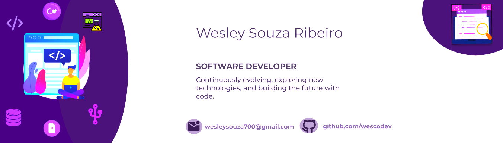

  

<h1 align='center'>
  Hi there 👋 I'm Wesley 👨‍💻
</h1>

  A developer from Brazil learning every day.

  

#

As a Computer Science student and Systems Analyst, my journey is a continuous path toward software development. Focused on building my skills in .NET and C#, I am constantly updating my knowledge and seeking new challenges in the tech field. I am passionate about learning and applying this knowledge to create innovative solutions.
  
#

<h3 align="left">Connect with me!</h3>

  
  

<h3 align="left">My Stack ~</h3>

  
  
  
  
  
  
  
  
  
  
  
  
  
  
  
  
  

#

<picture align="center">
  <source media="(prefers-color-scheme: dark)" srcset="https://raw.githubusercontent.com/mari4souza/mari4souza/output/github-contribution-grid-snake-dark.svg">
  <source media="(prefers-color-scheme: light)" srcset="https://raw.githubusercontent.com/mari4souza/mari4souza/output/github-contribution-grid-snake-dark.svg">
  
</picture>
